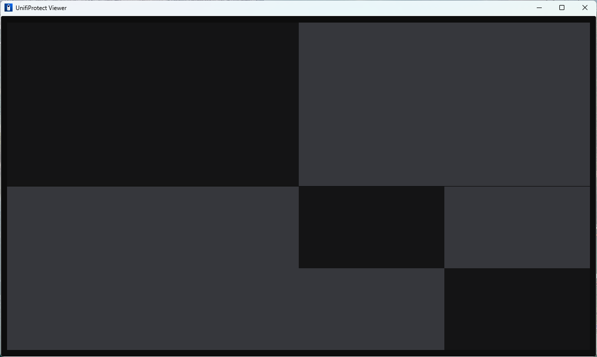
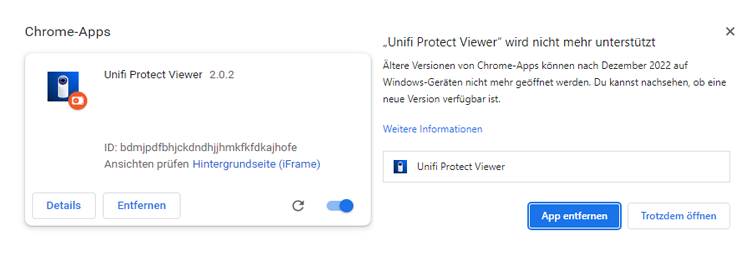

# UnifiProtect Viewer Electron App

This is an electron app for unifi protect liveview build by Sebastian Loer. This version was testet with unifi protect v4.0.21 (Version 2.x, Version 3.x is also compatible) running on an UDM-Pro. 

This app allows you to view your liveview from a simple app with automatic login. Just configure your unifi protect address and credentials and the app will automaticly login and present you the liveview you selected.

## Configuration

Just start the application and enter your credentials and url to your unifi protect instance.

Example Link: `https://192.168.1.1/protect/liveview/635e65bd000c1c0387005a5f` (Version 2)

Example Link: `https://192.168.1.1/protect/dashboard/635e65bd000c1c0387005a5f` (Version 3 & 4)

The Link needs to be set to the IP-address of your Unifi Protect installation. You can simply copy the link from your browser while viewing the liveview on your unifi protect instance.

## Installation

Ether you can download this application from github or build it yourself with this repository.

Copy the finished build to a location of your choice. Then you can start the application from this directory.

## Building

Install all dependencies with the `npm install` or `npm i` command. After this you can build the application yourself for your needed platform.

For some platforms there are scripts inside the package.json.
 
`npm run build:ia32:windows`

`npm run build:x64:macos`

`npm run build:arm64:macos`

`npm run build:x64:linux`

## Usage

After configuration the app will automaticly start the liveview after startup. If you want to change the configuration or when you misspell your credentials you can press `F10` to reset all settings and restart the configuration process.

- F9 Restart
- F10 Restart & Reset
- F11 Fullscreen (Electron, no Unifi Protect Fullscreen)

## Chrome App

Sadly google announced that there will be no support for chrome apps on windows, mac or linux after december 2022.

The Chrome app for Unifi Protect Viewer is based up on a version of remcotjeerdsma. The Version is fully functional, you can find instructions and the sourcecode under the following link.

https://github.com/digital195/unifi-protect-viewer/tree/caaec3523361f5494338b333426cc1af5a48707a