# 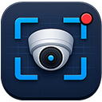 Unifi Protect Viewer

A clean Electron app that auto-logs into your Unifi Protect instance and presents the camera liveview in a distraction-free fullscreen layout — no headers, no navigation, no clutter.

> Tested with Unifi Protect **v2.x – v6.x** running on UDM-Pro / UDM-SE / CloudKey Gen2+.

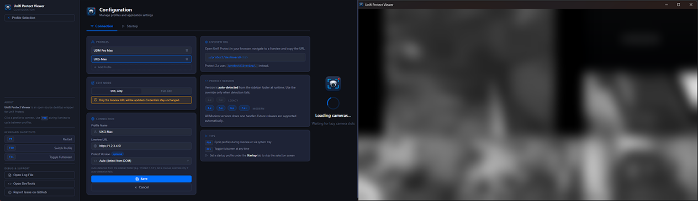

---

## Features

- 🔐 **Auto-login** — credentials are stored securely and used on every start
- 🖥️ **Fullscreen liveview** — all Unifi UI chrome is hidden automatically
- 📋 **Multiple profiles** — save any number of NVRs or dashboards and switch between them instantly
- ⚙️ **In-app configuration** — edit settings at any time without restarting (`F10` or tray menu)
- 🔗 **URL-only mode** — quickly switch liveviews without re-entering credentials
- 🔑 **Smart credential handling** — password is only overwritten when explicitly changed
- ⏳ **Loading overlay** — animated screen while cameras initialise, with 20 s auto-fallback
- 🔄 **Session auto-renewal** — re-logs in before the session token expires
- 🪟 **System tray** — minimize to tray, show/hide, switch profiles, open settings, quit
- 🔒 **Self-signed certificates** — accepted automatically
- 💾 **Portable mode** — config stored next to the executable (USB-stick friendly)
- 📐 **Persistent window geometry** — size and position remembered between sessions

---

## Screenshots

### Liveview
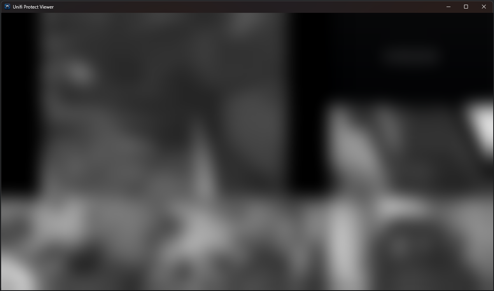

### Profile selection
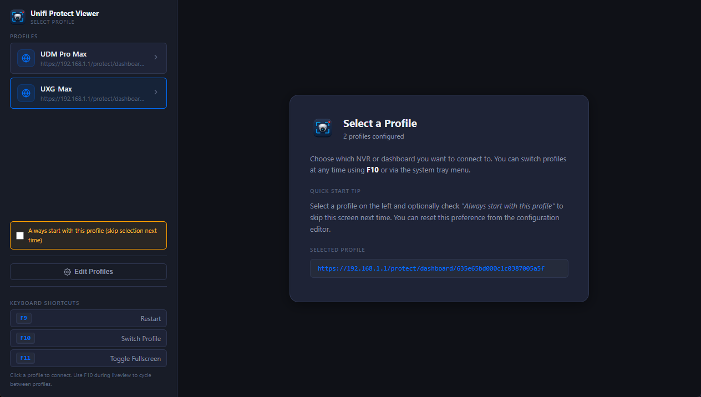

### Configuration – profile editor
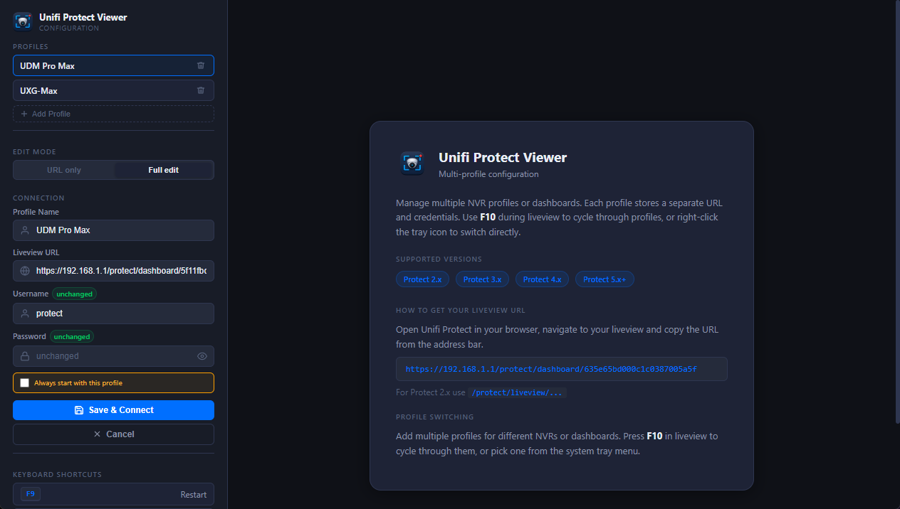

### Configuration – URL only mode
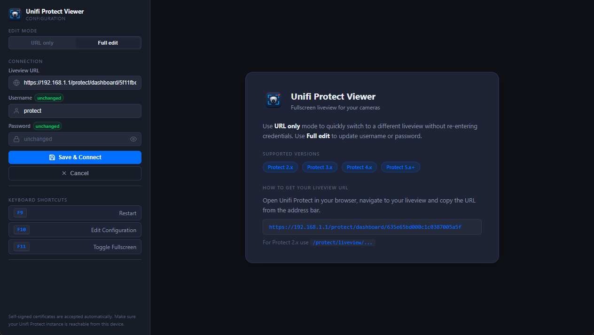

### Configuration – Full edit mode
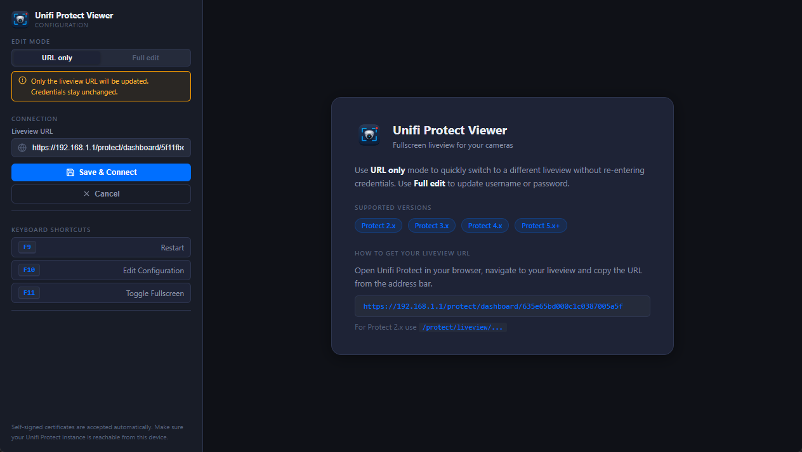

### Loading overlay
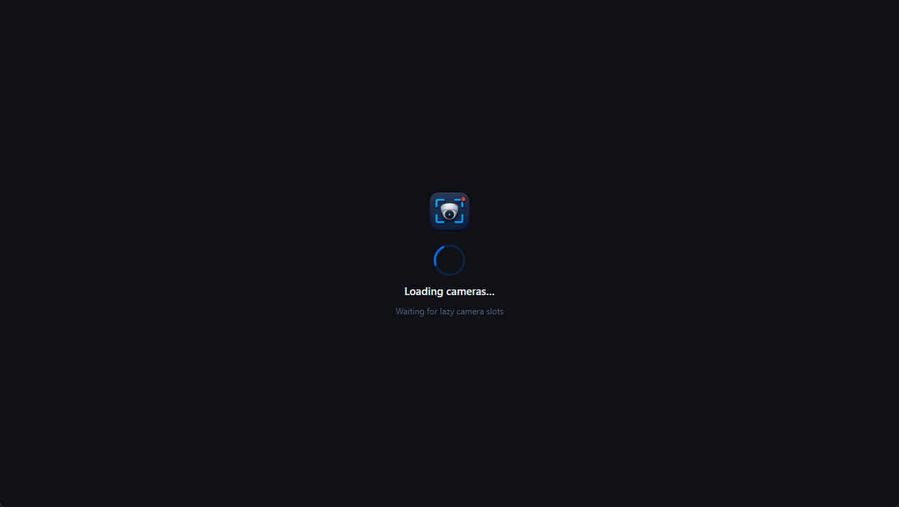

### Error page
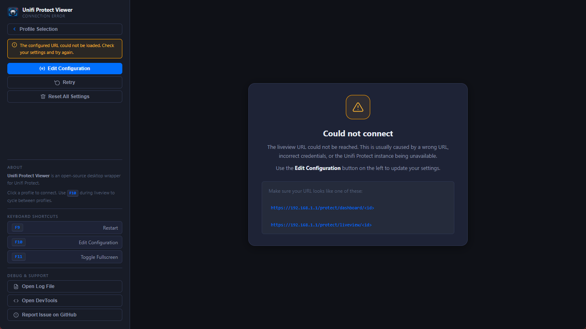

---

## Profiles

Unifi Protect Viewer supports saving **multiple profiles**. Each profile stores an independent set of:

| Field            | Description                                                                     |
|------------------|---------------------------------------------------------------------------------|
| **Profile name** | A label shown in the sidebar and tray menu (e.g. "Front Entrance", "Warehouse") |
| **Liveview URL** | Full URL to your liveview (copy from the browser address bar)                   |
| **Username**     | Unifi Protect / UnifiOS login                                                   |
| **Password**     | Your password                                                                   |

Profiles can point to **different NVRs**, **different dashboards on the same NVR**, or anything else — there are no restrictions.

### Profile selection on startup

When **more than one profile** is saved and no startup profile has been set, the **profile selection screen** is shown on launch. Click any profile to start it immediately.

Check **"Always start with this profile"** to skip the selection screen in the future and go straight to that profile's liveview. You can clear this preference at any time in the configuration editor.


### Managing profiles

Open the configuration editor (`F10` or tray → **Edit Configuration**).

- **Add** a new profile with the **+** button in the sidebar
- **Switch** between profiles by clicking them in the sidebar
- **Delete** the active profile with the **Delete** button (at least one profile must remain)
- **Set a startup profile** by enabling the **"Always start with this profile"** checkbox (only shown when more than one profile exists)

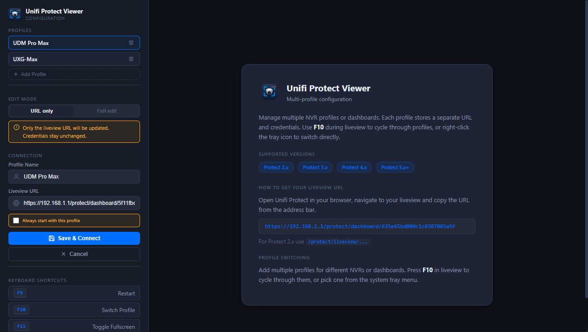

---

## Configuration

Start the application — the setup screen appears automatically on first launch.

| Field            | Description                                                   |
|------------------|---------------------------------------------------------------|
| **Profile name** | Optional display label for this profile                       |
| **Liveview URL** | Full URL to your liveview (copy from the browser address bar) |
| **Username**     | Unifi Protect / UnifiOS login                                 |
| **Password**     | Your password                                                 |

### Edit Modes

| Mode          | What changes                                               |
|---------------|------------------------------------------------------------|
| **URL only**  | Updates only the liveview URL – credentials stay unchanged |
| **Full edit** | Allows updating username and/or password                   |

The password field shows `unchanged` until you actually type something. The badge turns orange when a field has been modified.

### Example URLs

```
# Protect 3.x / 4.x / 5.x
https://192.168.1.1/protect/dashboard/635e65bd000c1c0387005a5f

# Protect 2.x
https://192.168.1.1/protect/liveview/635e65bd000c1c0387005a5f
```

---

## Keyboard Shortcuts

| Key | Action |
|---|---|
| `F9` | Restart the application |
| `F10` | Open profile selection (2+ profiles) or configuration editor (1 profile) |
| `F11` | Toggle fullscreen |

### F10 behaviour in detail

| Context                                        | Result                             |
|------------------------------------------------|------------------------------------|
| Liveview, 1 profile saved                      | Opens the configuration editor     |
| Liveview, 2+ profiles saved                    | Opens the profile selection screen |
| Configuration / profile selection / error page | Opens the configuration editor     |

---

## Tray Menu

Right-click the system-tray icon for:

**Show / Hide** · **Edit Configuration** · **Switch Profile** *(list of all saved profiles with the active one checked)* · **Restart** · **Reset & Restart** · **Quit**

Clicking a profile in the **Switch Profile** submenu loads it immediately without restarting.

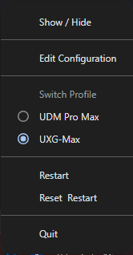

---

## Installation

Download a pre-built release from the Releases page, or build it yourself (see below).

---

## Building

### Prerequisites

```bash
npm install
```

### Local builds

```bash
# Current platform / arch (reads env vars or falls back to host)
npm run build

# Explicit targets
npm run build:win:x64
npm run build:win:ia32
npm run build:mac:x64
npm run build:mac:arm64
npm run build:linux:x64
npm run build:linux:arm64

# Portable variants (append :portable to any target above)
npm run build:win:x64:portable
npm run build:linux:arm64:portable
```

All output lands in `builds/` and is automatically renamed to include the version:
```
builds/unifi-protect-viewer-win32-x64-1.0.0/
builds/unifi-protect-viewer-win32-x64-1.0.0-portable/
builds/unifi-protect-viewer-linux-arm64-1.0.0-portable/
```

### Build environment variables

All build options are controlled via environment variables — no source files need to be changed.

| Variable | Default | Description |
|---|---|---|
| `UPV_PLATFORM` | host platform | `win32` · `darwin` · `linux` |
| `UPV_ARCH` | host arch | `x64` · `ia32` · `arm64` |
| `UPV_PORTABLE` | `false` | `true` → portable build |
| `UPV_OUT_DIR` | `builds` | output directory |
| `UPV_ENCRYPTION_KEY` | `****` | encryption key for portable config store |

**PowerShell example:**
```powershell
$env:UPV_PLATFORM="linux"; $env:UPV_ARCH="arm64"; $env:UPV_PORTABLE="true"
node scripts/build.js
```

---

## Portable Mode

When `UPV_PORTABLE=true`, the config is stored in a `store/` directory next to the executable instead of the OS user-data folder. All profiles are included. Ideal for USB sticks or kiosk setups.

> ⚠️ Set a strong `UPV_ENCRYPTION_KEY` before distributing portable builds.

Window size/position is **not** persisted in portable mode.

---

## Project Structure

```
src/
├── main.js                  # Electron entry point
├── main/
│   ├── app.js               # App bootstrap & lifecycle
│   ├── ipc.js               # IPC handler registration
│   ├── store.js             # Persistent config storage – profiles, startup pref, window bounds
│   ├── tray.js              # System-tray icon & context menu (incl. profile switcher)
│   └── window.js            # Main window factory & load-failure handler
├── html/
│   ├── config.html          # Configuration / profile editor
│   ├── profile-select.html  # Profile selection screen (shown on startup with 2+ profiles)
│   ├── index.html           # Error / connection-failure page
│   └── shared.css           # Shared design system (dark theme variables, components)
├── js/
│   ├── preload.js           # Electron preload – IPC bridge + all liveview automation
│   └── liveview/            # Reference copies (not loaded at runtime)
│       ├── utils.js         # Shared DOM utilities
│       ├── overlay.js       # Loading overlay
│       ├── login.js         # Auto-login handler
│       ├── v2.js            # Liveview handler – Protect 2.x
│       ├── v3.js            # Liveview handler – Protect 3.x
│       └── v4.js            # Liveview handler – Protect 4.x / 5.x / 6.x
└── img/
    └── 128.png / 128.ico / 128.icns / 512.png

scripts/
└── build.js                 # Universal build script (env-var driven)
```

> **Note on `src/js/liveview/`:** The Electron preload sandbox (`contextIsolation=true`) does not
> allow loading local files via `require()`. All liveview logic is inlined directly into
> `preload.js`. The files in `liveview/` are readable reference copies — edit them there and sync
> changes into the matching section of `preload.js`.

### Data model

Each profile is stored as a JSON object in the encrypted config store:

```jsonc
{
  "profiles": [
    {
      "id": "uuid-v4",
      "name": "Living Room NVR",
      "url": "https://192.168.1.1/protect/dashboard/635e…",
      "username": "admin",
      "password": "<encrypted>"
    }
  ],
  "activeProfileId": "uuid-v4",   // currently loaded profile
  "startupProfileId": "uuid-v4"   // auto-selected on launch (null = show selector)
}
```

Existing single-profile installations are **migrated automatically** on first launch — no data is lost.

---

## Development

```bash
npm start
```

Hot-reload via `electron-reloader`. Open DevTools via right-click inside the window.  
All automation steps emit `[upv]`-prefixed log messages so you can follow every step in the console.

---

## License

[MIT](LICENSE) © 2026 Sebastian Loer — use it however you like, commercially or otherwise. Attribution appreciated.

---

## AI Disclosure

The refactoring, feature additions and documentation of this project were developed with the assistance of **Claude Sonnet 4.6** (Anthropic) via GitHub Copilot.

---

## History

Originally inspired by the [Unifi Protect Chrome App](https://github.com/digital195/unifi-protect-viewer/tree/caaec3523361f5494338b333426cc1af5a48707a) by remcotjeerdsma / digital195, which first had the idea of stripping the Unifi Protect UI chrome to show a clean camera liveview.
